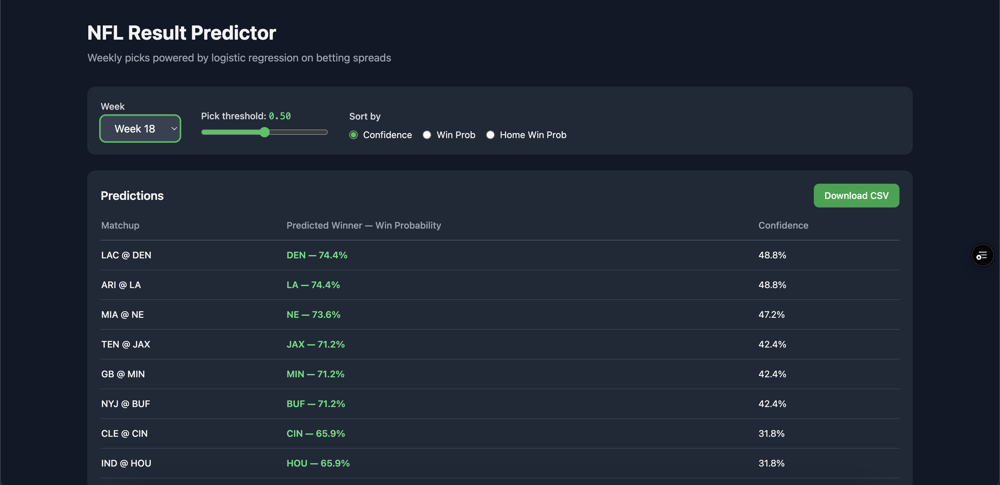

# NFL Result Predictor



A machine learning system for predicting NFL game outcomes, built for the **2025 season**.  
Live at **[nfl-result-predictor-am11.vercel.app](https://nfl-result-predictor-am11.vercel.app)**

---

## What it does

- Fetches the full NFL schedule via `nfl_data_py`
- Engineers features from betting spreads and home-field advantage
- Trains a logistic regression model on historical results
- Generates weekly win probabilities and predicted winners
- Serves an interactive web dashboard deployed on Vercel

---

## Web App

The dashboard is deployed at **https://nfl-result-predictor-am11.vercel.app**

Features:
- Week selector (defaults to latest week)
- Adjustable pick threshold (0.40–0.60)
- Sort by confidence, win probability, or home win probability
- Interactive horizontal bar chart per matchup
- CSV download of filtered predictions

---

## Project Structure

```
NFLResultPredictor/
├── api/                        # Vercel serverless functions
│   ├── predictions.py          # GET /api/predictions?week=X&threshold=Y
│   └── weeks.py                # GET /api/weeks
├── public/
│   └── index.html              # Web dashboard frontend
├── Season25/
│   ├── data/
│   │   ├── raw/                # schedule_2025.csv
│   │   └── processed/          # predictions_2025_wkN.csv (weeks 1–18)
│   ├── models/
│   │   ├── artifacts/          # baseline_logreg.pkl
│   │   └── reports/            # baseline_metrics.txt
│   ├── scripts/
│   │   ├── refresh_all.py      # Full retrain pipeline
│   │   ├── get_week.py         # CLI wrapper for predictions
│   │   └── serve_streamlit.py  # Legacy local Streamlit UI
│   └── src/
│       ├── data.py             # Schedule fetching & I/O
│       ├── features.py         # Feature engineering
│       ├── train.py            # Model training
│       └── predict.py          # Prediction generation
├── requirements.txt
└── vercel.json
```

---

## Local Development

### Prerequisites
- Python 3.11+
- Node.js 18+ (for Vercel CLI)

### Setup

```bash
git clone https://github.com/alexmekhail/NFLResultPredictor.git
cd NFLResultPredictor

python3 -m venv .venv
source .venv/bin/activate      # macOS/Linux
# .\.venv\Scripts\Activate.ps1  # Windows

pip install -r requirements.txt
```

### Retrain the model

```bash
python Season25/scripts/refresh_all.py
```

Fetches current season data, trains the model, saves metrics to `models/reports/`.

### Generate predictions for a week

```bash
python Season25/scripts/get_week.py --season 2025 --week 18
```

Saves results to `Season25/data/processed/`.

### Run the local Streamlit UI (legacy)

```bash
streamlit run Season25/scripts/serve_streamlit.py
```

---

## Model

| Detail | Value |
|--------|-------|
| Algorithm | Logistic Regression |
| Features | Betting spread (home perspective), home-field indicator |
| Preprocessing | StandardScaler |
| Test Accuracy | 56% |
| ROC-AUC | 76% |
| Test set size | 25 games |

---

## Deploy

```bash
npm i -g vercel
vercel --prod
```

The `api/` directory contains Python serverless functions; `public/` serves the static frontend.

---

## Roadmap

- Rolling team statistics (yards/play, turnovers, rest days, EPA/play)
- Injury and weather data integration
- Advanced models (XGBoost / LightGBM ensembles)
- Probability calibration
- Walk-forward backtesting for season-long evaluation
- Automated weekly retraining via GitHub Actions
