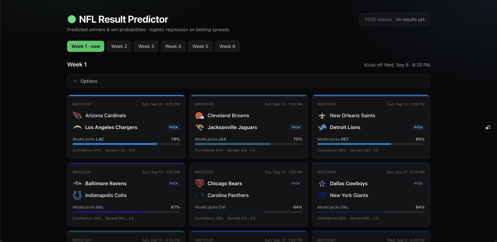

# NFL Result Predictor



A machine learning system for predicting NFL game outcomes, built for the **2026 season**.  
Live at **[nfl-result-predictor-am11.vercel.app](https://nfl-result-predictor-am11.vercel.app)**

---

## What it does

- Fetches the full NFL schedule via `nfl_data_py`
- Engineers features from betting spreads and home-field advantage
- Trains a logistic regression model on historical results
- Generates weekly win probabilities and predicted winners
- Serves an interactive web dashboard deployed on Vercel

---

## Web App

The dashboard is deployed at **https://nfl-result-predictor-am11.vercel.app**

Features:
- Week selector (defaults to latest week)
- Adjustable pick threshold (0.40–0.60)
- Sort by confidence, win probability, or home win probability
- Interactive horizontal bar chart per matchup
- CSV download of filtered predictions

---

## Project Structure

```
NFLResultPredictor/
├── api/                        # Vercel serverless functions
│   ├── predictions.py          # GET /api/predictions?week=X&threshold=Y
│   └── weeks.py                # GET /api/weeks
│                               # (both auto-detect the highest-numbered SeasonNN/ folder)
├── public/
│   └── index.html              # Web dashboard frontend
├── Season26/                    # Current season (mirror this folder each year)
│   ├── config.yaml             # season: 2026, train_seasons: [2025]
│   ├── data/
│   │   ├── raw/                # schedule_train_*.csv, schedule_2026.csv
│   │   └── processed/          # predictions_2026_wkN.csv
│   ├── models/
│   │   ├── artifacts/          # baseline_logreg.pkl
│   │   └── reports/            # baseline_metrics.txt
│   ├── scripts/
│   │   ├── refresh_all.py      # Full retrain pipeline
│   │   ├── get_week.py         # CLI wrapper for predictions
│   │   ├── backtest.py         # Score the model vs completed seasons
│   │   └── serve_streamlit.py  # Legacy local Streamlit UI
│   ├── src/
│   │   ├── data.py             # Schedule fetching & I/O (cwd-independent paths)
│   │   ├── features.py         # Feature engineering
│   │   ├── train.py            # Model training
│   │   └── predict.py          # Prediction generation
│   └── requirements.txt        # Model-pipeline deps (pinned)
├── Season25/                    # Prior season (kept for history)
├── requirements.txt            # Streamlit dashboard deps
└── vercel.json
```

---

## Local Development

### Prerequisites
- Python 3.11+
- Node.js 18+ (for Vercel CLI)

### Setup

```bash
git clone https://github.com/alexmekhail/NFLResultPredictor.git
cd NFLResultPredictor

python3.11 -m venv Season26/.venv
source Season26/.venv/bin/activate      # macOS/Linux
# .\Season26\.venv\Scripts\Activate.ps1  # Windows

pip install -r Season26/requirements.txt
```

Scripts resolve their paths relative to the season folder, so they can be run
from anywhere (from inside `Season26/` or as `python Season26/scripts/...` from
the repo root) and always read/write under `Season26/`.

### Retrain the model

```bash
python Season26/scripts/refresh_all.py
```

Fetches the `train_seasons` schedules (see `Season26/config.yaml`), trains the
model on completed games, and saves metrics to `Season26/models/reports/`.

### Generate predictions for a week

```bash
python Season26/scripts/get_week.py --season 2026 --week 1
```

Saves results to `Season26/data/processed/`. Weeks without a published betting
spread yet will produce fewer (or no) rows until closer to game time.

### Backtest the model against completed seasons

```bash
python Season26/scripts/backtest.py                        # default: 2023, 2024, 2025
python Season26/scripts/backtest.py --seasons 2022 2023 2024
```

Writes `Season26/models/reports/backtest.txt`. See
[How accuracy is calculated](#how-accuracy-is-calculated) below.

### Run the local Streamlit UI (legacy)

```bash
pip install -r requirements.txt
streamlit run Season26/scripts/serve_streamlit.py
```

---

## Model

| Detail | Value |
|--------|-------|
| Algorithm | Logistic Regression |
| Features | Betting spread (home perspective), home-field indicator |
| Preprocessing | StandardScaler |
| Training data | 2025 season, completed games (228 train / 57 test) |
| Held-out test accuracy | 67% |
| Held-out test ROC-AUC | 72% |

Held-out metrics live in `Season26/models/reports/baseline_metrics.txt` and
change whenever the model is retrained (e.g. once 2026 games are added to
`train_seasons`).

### Backtest results

Running the trained model over full past seasons and checking each pick against
the game that was actually played (`Season26/scripts/backtest.py`):

| Season | Games | Winner accuracy | ROC-AUC | "Always pick home" | "Pick the favorite" |
|--------|-------|-----------------|---------|--------------------|---------------------|
| 2023 (out-of-sample) | 285 | **67.4%** | 0.693 | 56.5% | 67.4% |
| 2024 (out-of-sample) | 285 | **70.5%** | 0.756 | 54.7% | 70.5% |
| 2025 (in training set) | 285 | 66.0% | 0.722 | 53.3% | 66.0% |
| **Pooled 2023–2025** | 855 | **68.0%** (581/855) | 0.725 | 54.9% | 68.0% |

The model's accuracy matches "just pick the Vegas favorite" to three decimals
every season: the only informative feature is the betting spread (`is_home` is a
constant 1), so the model is a calibrated function of the line rather than an
edge over it. It does clearly beat naive baselines like always picking the home
team (~55%).

### How accuracy is calculated

For each completed game the model outputs `P(home team wins)`. The **predicted
winner** is the home team when that probability is `>= 0.5` (the
`--threshold`), otherwise the away team. A pick is **correct** when the
predicted winner is the team that actually won (equivalently,
`pred_home_win == home_win`, since the label is framed from the home side).

```
accuracy = correct winner picks / completed games
```

Only games with a final score are counted (unplayed games have no outcome to
check). Ties can't occur in the label because `home_win` is
`home_score > away_score`. `roc_auc` is scikit-learn's ROC-AUC of the raw
`P(home win)` against the actual `home_win` outcome — it rewards the model for
ranking games by confidence, not just for the 0.5 cutoff.

- `always_pick_home` — accuracy if you predicted the home team every game.
- `pick_favorite` — accuracy of taking whichever team the spread favors
  (games with a pick'em line of 0 excluded).

Out-of-sample = seasons the model was **not** trained on (`train_seasons` in
`config.yaml`); those numbers are the honest estimate of future accuracy.

---

## Deploy

```bash
npm i -g vercel
vercel --prod
```

The `api/` directory contains Python serverless functions; `public/` serves the static frontend.

---

## Roadmap

- Rolling team statistics (yards/play, turnovers, rest days, EPA/play)
- Injury and weather data integration
- Advanced models (XGBoost / LightGBM ensembles)
- Probability calibration
- Walk-forward backtesting for season-long evaluation
- Automated weekly retraining via GitHub Actions
